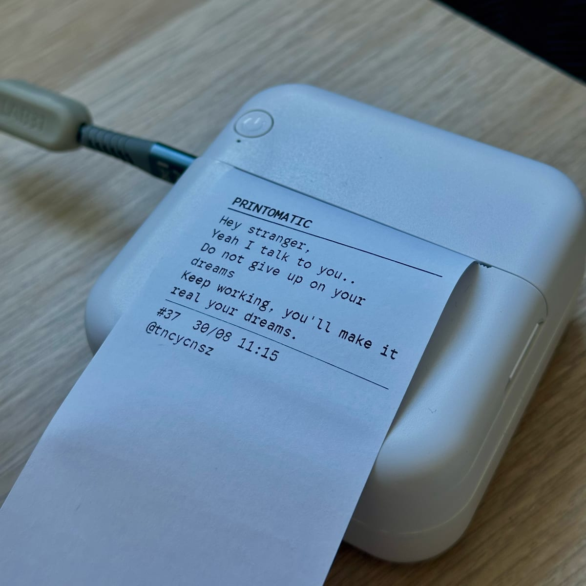

# Print on my desk

A thermal printer on your desk, with a web page in front of it. Somebody opens
the link, writes a message, and it comes out on paper, in your room, a few
seconds later.

It is not a product and it is not meant to scale. It is meant to be **yours**:
one printer, one link, and the people you send that link to.

<!-- A picture goes here, and it is the most useful thing this file could gain.
     See docs/images/README.md for what to take. Uncomment when you have one:


-->

---

## What you are building

```
  somebody's phone            your Cloudflare Worker            your printer
  ────────────────            ──────────────────────            ────────────
  writes a message   ──────►  checked, filtered, queued  ──────►  paper
                              you approve it on /admin
```

Three parts, and only the middle one runs anywhere but your home:

* **The page.** Where people write. Plain HTML, no framework, no build step.
* **The Worker.** One Cloudflare Worker and one SQLite database, both on the
  free plan. It holds the queue, filters what arrives, and lets you approve
  things from your phone.
* **The bridge.** Whatever actually drives the printer. Pick one of three,
  below.

Everything is free to run. The Cloudflare free plan covers this comfortably —
[docs/07-operating.md](docs/07-operating.md) has the arithmetic, including what
happens when a link goes round and five thousand messages arrive in a day.

---

## Which version do you want?

| | You need | Runs when | Set-up |
| :-- | :-- | :-- | :-- |
| **Browser** | A cheap Bluetooth thermal printer, and Chrome | A tab is open | **~30 min** |
| **Always-on** | A Raspberry Pi or any computer you leave on, and either kind of printer | Always | ~1 hour |
| **Microcontroller** | A Pico 2 W, soldering optional | Always, on 2 W of power | An afternoon |

**Start with the browser version.** It is the one where you can see the whole
thing working before you commit to anything: leave the tab open and messages
print, close it and they wait. If you later want it running while you are out,
the always-on version uses the same Worker, the same queue and the same page —
you swap what is at the far end and change nothing else.

➜ **[docs/01-quick-start.md](docs/01-quick-start.md)** — the browser version,
from nothing to paper.

---

## If you are not technical

You do not need to understand any of this. What you need is:

1. An hour.
2. A Cloudflare account (free, no card).
3. A thermal printer — [which one to buy](docs/04-printers.md).
4. Either patience with a terminal, or an AI coding assistant.

**On that last point.** This repository is written to be handed to a coding
assistant. Clone it, open it in Claude Code (or Cursor, or whatever you use),
and say:

> Read AGENTS.md and set this up for me. Ask me for anything you need.

[AGENTS.md](AGENTS.md) is written for exactly that: it tells the assistant what
this project is, what order to do things in, what it must ask you rather than
guess, and — importantly — what it must not do on your behalf. It has been kept
short enough to actually be read.

---

## What it does that you would otherwise have to think of

Most of this project is not the printing. The printing took a week. The rest is
what a public link turns out to need:

* **Nothing prints without you.** Every message waits for you to approve it,
  from your phone. That is the default, and it is the setting you should keep.
* **A filter that is not stupid about it.** Confusables, leetspeak, spaced-out
  letters and repeated letters are all folded before matching, so "n1gg3r" and
  "n i g g e r" are caught — while "Scunthorpe" and "classic" are not, because
  short terms only ever match whole words. [docs/06-moderation.md](docs/06-moderation.md).
* **Rate limits that survive a bad afternoon.** Per person, per hour, per day,
  plus proof-of-work on the form so a script cannot post faster than a person.
* **Heat.** A thermal head that keeps printing cooks itself. The printer
  reports its own temperature and the bridge refuses to start above a
  threshold, then waits for it to fall.
* **Paper.** The printer's only paper signal is "empty", and it arrives too
  late. So the queue counts the lines it has sent and estimates what is left.
* **A queue that survives everything.** A message is never lost: not by a
  failed print, not by a power cut mid-ticket, not by a filter you disagree
  with — every refusal can be overridden, and nothing is ever deleted.
* **A database bill that does not grow with your success.** This is not a
  throwaway line. Read [docs/07-operating.md](docs/07-operating.md) §4 before
  you add a query.

---

## A word about who you give the link to

This is built for a link you send to people, not for a link you post to the
internet at large.

That is a physical constraint, not a philosophical one. A thermal head has a
duty cycle; a roll of paper is finite and costs money; and the printer sits in
a room where somebody sleeps. A hundred friends is a delight. A thousand
strangers is a machine that overheats, a roll that runs out at 3 a.m., and a
moderation queue you will stop reading by the second day.

The defaults here assume the first case: three messages per person per day,
and everything held for your approval. If you point this at a wider audience, read
[docs/07-operating.md](docs/07-operating.md) first and turn things down, not up.

---

## Documentation

| | |
| :-- | :-- |
| [01 · Quick start](docs/01-quick-start.md) | Nothing to paper, browser version |
| [02 · Always on](docs/02-always-on.md) | Raspberry Pi or any computer left running |
| [03 · Microcontroller](docs/03-microcontroller.md) | Pico 2 W over Bluetooth |
| [04 · Printers](docs/04-printers.md) | What to buy, and what will not work |
| [05 · Customising](docs/05-customising.md) | Fonts, wording, the ticket itself |
| [06 · Moderation](docs/06-moderation.md) | The filter, and writing your own list |
| [07 · Operating](docs/07-operating.md) | Limits, heat, paper, closing, costs |
| [08 · Troubleshooting](docs/08-troubleshooting.md) | When it does not work |
| [09 · The protocol](docs/09-protocol.md) | How the Bluetooth printer actually works |
| [10 · ESC/POS](docs/10-escpos.md) | The 80 mm receipt printer, over USB |
| [AGENTS.md](AGENTS.md) | For a coding assistant doing this with you |

---

## Security

A public form that causes a physical event in somebody's home. What stands
between a stranger and your paper, what the trust boundaries are, and what the
known limitations honestly are: [SECURITY.md](SECURITY.md).

## Licence

[AGPL-3.0](LICENSE). Run it, change it, keep it — but if you run a *modified*
copy as a service other people use, they are entitled to your source.

Please give your fork its own name. See [NOTICE](NOTICE), which also explains
what was deliberately left out of this repository and why.
